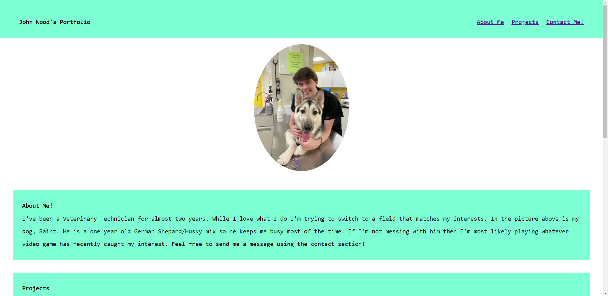
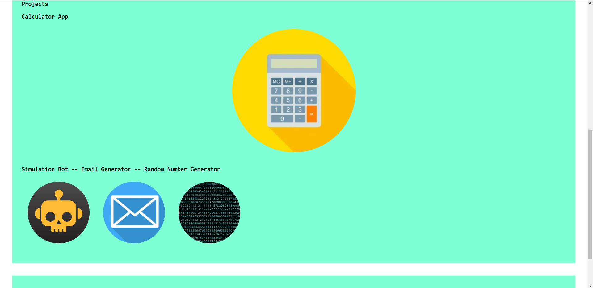
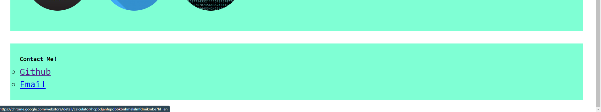

## Mitchell's Portfolio

## Description

- My motivation to build this project was to create a "one-stop-shop" for anybody interested in learning more about me and finding ways to contact me.
- I built this project to facilitate the process of finding out information about me and what I've done.
- It solves the problem of having to search for contact information/completed projects, as they're all on one site.
- During this project I learned how to build a website from the ground up and troubleshoot problems of my own creation.

## Installation

- Visit https://mitchell4563.github.io/Challenge-02/

## Usage

- Using the Nav bar links located in the top right of the page, you can relocate your focus to one of three different sections. Also, embedded in all images except for the identification photo are links to "my projects" which all will open in a new tab.

## Credits

- N/A

## License

- Please Refer to the license in the repo